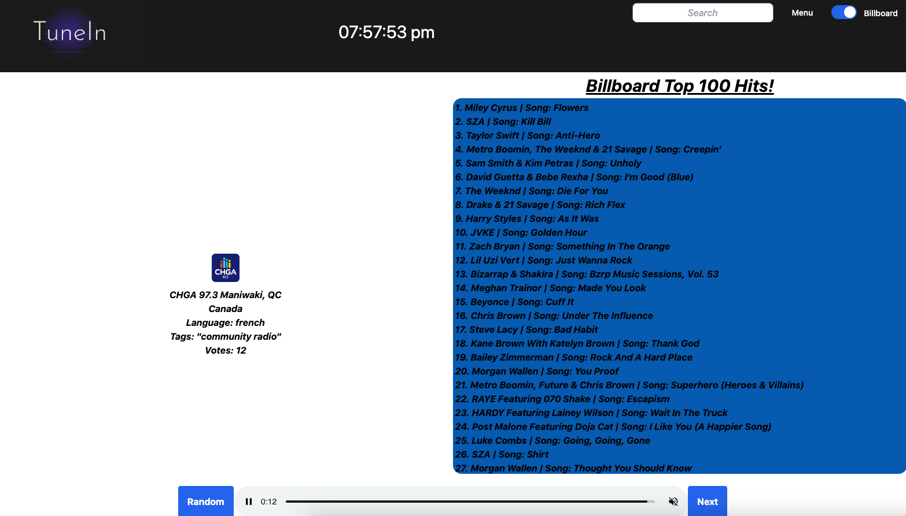

# Project-1-Team-5

## Description
<br>
This Radio Browser is for users looking to search for radio stations based on where they live or the genre of music. This project is built to create an opportunity for users to explore different radio stations. The main goal is to provide an easy efficient radio browser for everyone to use that also includes the top 100 hits.

## Collaborators
```
Cassandra Watson, Ricky Nguyen and Michael Frayne. 
```

## Installation 

N/A

## User Story 📘
```
AS A user with an interest for new music,
I WANT to be able to listen to different radio stations based on my favourite genres of music or the country I live in
SO THAT I can listen to all of the music that I like 
```
<br>

## Acceptance Criteria ✅
<br>
GIVEN I am using a radio browser to listen to music I enjoy

WHEN I open the radio browser
THEN I am able to select my favourite genres of music I like OR the country that I live in 

WHEN I select my country OR genre of choice and close the modal
THEN I will be forwarded to a radio station relevant to my selections

WHEN the billboard toggle is switched on
THEN I will see the top 100 billboard hits 

WHEN I click a button(random)
THEN I will be given a randomized radio station to listen to

## 

## Deployment Link 🔗
[Deployment link](https://xmoonphasex.github.io/Project-Tune-in-Team-5/)<br>

[Repo link](https://github.com/XMoonphaseX/Project-Tune-in-Team-5)<br>

## API's
[Genius API](https://docs.genius.com/#/getting-started-h1)<br>
[Radio API](https://api.radio-browser.info/)<br>
[Jquery](https://jquery.com)<br>
[JqueryUi](https://jqueryui.com)<br>


## Licence 🔑

MIT License

Copyright (c) [2023]

Permission is hereby granted, free of charge, to any person obtaining a copy
of this software and associated documentation files (the "Software"), to deal
in the Software without restriction, including without limitation the rights
to use, copy, modify, merge, publish, distribute, sublicense, and/or sell
copies of the Software, and to permit persons to whom the Software is
furnished to do so, subject to the following conditions:

The above copyright notice and this permission notice shall be included in all
copies or substantial portions of the Software.

THE SOFTWARE IS PROVIDED "AS IS", WITHOUT WARRANTY OF ANY KIND, EXPRESS OR
IMPLIED, INCLUDING BUT NOT LIMITED TO THE WARRANTIES OF MERCHANTABILITY,
FITNESS FOR A PARTICULAR PURPOSE AND NONINFRINGEMENT. IN NO EVENT SHALL THE
AUTHORS OR COPYRIGHT HOLDERS BE LIABLE FOR ANY CLAIM, DAMAGES OR OTHER
LIABILITY, WHETHER IN AN ACTION OF CONTRACT, TORT OR OTHERWISE, ARISING FROM,
OUT OF OR IN CONNECTION WITH THE SOFTWARE OR THE USE OR OTHER DEALINGS IN THE
SOFTWARE.
